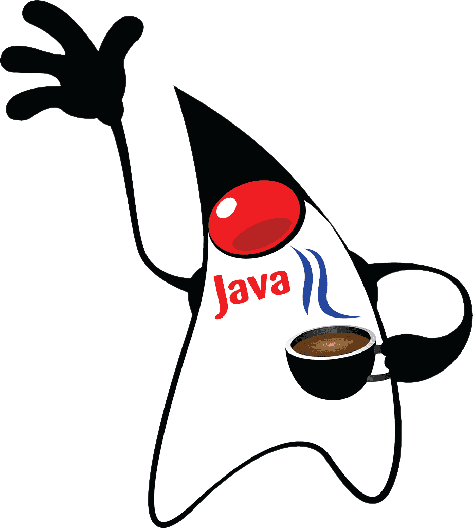

# Olá meus jovens 👋

Me chamo Henrique Cabral, tenho 20 anos, moro em Uberlândia-MG, curso atualmente bacharelado em Sistemas de Informação, atualmente estou em busca de um cargo de desenvolvedor **Backend Junior**.

Apaixonado pelo universo da programação, atualmente estou focado em aprimorar meus conhecimentos na área de __backend__ com *Java* e *Spring Boot*. Um dos motivos pelos quais escolhi o ramo da programação é a oportunidade de criar projetos que possam beneficiar a vida das pessoas por meio da tecnologia.

### ✨ Curiosidades

- Gosto de fazer academia.
- Até o momento sei cuidar de "Prantas".
- As vezes faço trocadilhos / piadas ruins.
- Coisas que ninguém acredita: eu odeio café.
- Comida preferida: Lasanha.

## 📋 Skills

* HTML
* CSS
* JAVASCRIPT
* JAVA
* PHP
* MYSQL

## 📫 Contatos

[Instagram](https://www.instagram.com/henrique_bastoos/?igshid=MzRlODBiNWFlZA%3D%3D)
[Linkedin](https://www.linkedin.com/in/henrique-bastos-32a427239/)
